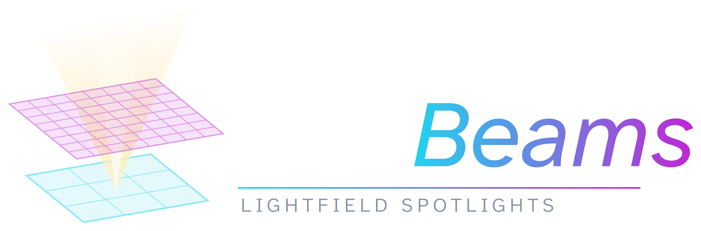

Volumetric light beams for VRChat. As seen in **Stage Flight** and **Furality**.

_Still in active development, function signatures may change and stuff >>_

Example uses:
1. Spotlights for light shows
2. Projector light for video players
3. Ambient light shafts

## Installation
Either clone the whole project, or copy-paste Assets/LUTBeam/ into your project.

## Usage
1. Place a **LUTBeamManager prefab** in the scene
2. Place a **LUTBeamSimple prefab** in the scene
3. ???

### To change gobo (light cookie) images
1. change one of the textures in LUTBeamManager
2. Right click LUTBeamManager component and click "Generate Texture Array".

## Notes
- Not reccomended for use on avatars, should work but may require some changes to be good.
- LUBeamManager is needed for a grab-pass to make the beam projection on surfaces look good.
- VRSL: Don't know but should be easy to integrate.

## Attribution
All the code in **Assets/LUTBeam/** is MIT / Public Domain, no attribution or liscence required

Therinization image is by Nightshades

Tiles texture is from textures.com

Gobo textures are mostly by me, don't 100% remember.

## How?
Raymarching volumetrics per pixel is way too expensive, I get around this by baking raymarch results to a lookup texture (LUT), so that they can later be grabbed very fast at runtime.

Somewhat similar to Latrix Laser System by OwenTheProgrammer, though theirs is far more advanced.

