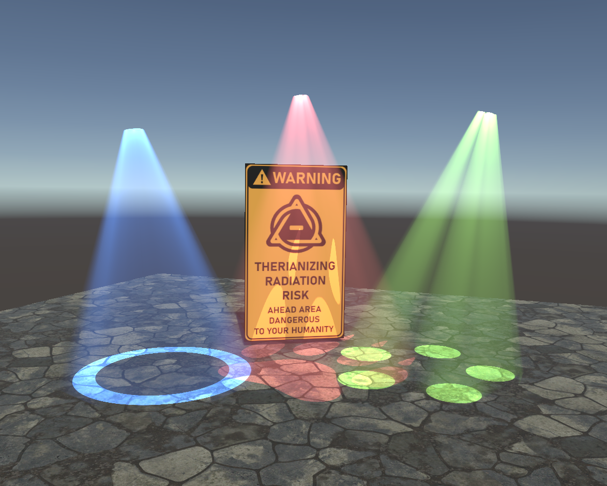
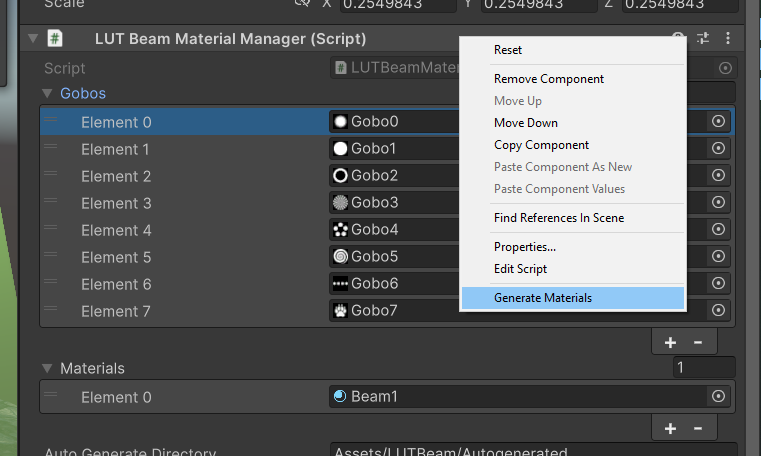

# LUTBeams
Still a bit work inprogress! fixing bugs and stuff ^^

Volumetric light beams for VRChat. As seen in **Stage Flight** and **Furality**.

Example uses:
1. Spotlights for light shows
2. Projector light for video players
3. Ambient light shafts

## Usage
1. place a LUTBeamManager in the scene
2. place a LUTBeam in the scene
3. ???

When running the LUT bake in a CRT, make sure it's going down _Fast > 0.5, otherwise it will be *extremely* slow

## To change gobo images
Replace the images in the LUTBeamManager, then right click it and press "Generate Materials". This will update the texture arrays with your new gobos.

## Use with VRSL
Don't know but should be easy to integrate.

## Liscence
All the code is MIT / Public Domain.

Therinization image is by Nightshades

Tiles texture is from textures.com

Gobos textures are mostly by me, don't 100% remember.

## How?
Raymarching volumetrics per pixel is way too expensive, I get around this by baking raymarch results to a lookup texture (LUT), so that they can later be grabbed very fast at runtime.

Somewhat similar to Latrix Laser System by OwenTheProgrammer, though theirs is far more advanced.

